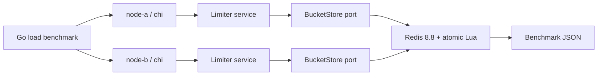

# #12 go-rate-limiter: 5,543.34 req/s at 28.290 ms p95

**Claim:** two HTTP nodes enforce one global token-bucket quota through atomic Redis state.

**Benchmark:** median `5,543.34 req/s` total, `1,197.66 req/s` accepted, `4,347.93 req/s` rejected, and `28.290 ms` p95 across two nodes, with zero errors and zero global-limit violations in three runs.

[](https://github.com/Brilhante29/go-rate-limiter/actions/workflows/ci.yml)

## What It Proves

- Two independently addressed HTTP nodes consume the same Redis-backed bucket.
- One Lua script refills and consumes tokens atomically using Redis server time.
- The benchmark fails if either node is missing, unexpected responses occur, or accepted traffic exceeds the global theoretical maximum.
- The limiter core imports neither chi nor go-redis; memory and Redis implement the same narrow output port.
- The default path uses no account, cloud service, or secret.

## Run With Docker

```powershell
docker build -t go-rate-limiter .
docker run --rm go-rate-limiter
```

The second command starts an ephemeral Redis process, exposes two internal HTTP nodes, drives the shared key under contention, prints JSON, and exits. To regenerate the committed result on Windows, Linux, or macOS:

```powershell
pwsh -NoProfile -File tools/benchmark.ps1
```

## Benchmark Result

| Metric | Value | Meaning |
|---|---:|---|
| accepted_rps | 1,197.66 | Median requests admitted by the configured global quota |
| rejected_rps | 4,347.93 | Median excess requests rejected with HTTP 429 |
| total_rps | 5,543.34 | Median aggregate load handled by both nodes |
| p95_latency_ms | 28.290 | Median end-to-end p95 decision latency |
| nodes_observed | 2 | Proof that traffic reached both nodes |
| global_limit_violations | 0 | Accepted count stayed below burst + refill in every run |

Workload: one warm-up followed by three 5-second runs at concurrency 64, 1,000 tokens/s and burst 1,000. Measured on Docker Linux/amd64 with 6 CPUs, Go 1.26.5, Redis 8.8.0, and two independently addressed HTTP nodes on 2026-08-14. Throughput samples were 5,404.27, 6,473.98, and 5,543.34 req/s.

Result: `benchmarks/results/rate-limiter-baseline.json`.

## Architecture



Dependency direction: `httpapi -> limiter <- redisstore`. The application policy does not import transport, Redis, cloud, or orchestration code.

## Algorithm

Each Redis key stores `tokens` and `updated_at_ms`. One atomic script:

1. reads Redis server time, avoiding node clock skew;
2. refills up to the configured burst;
3. consumes the requested cost when enough tokens remain;
4. returns allowed, remaining, and retry delay;
5. expires idle buckets to bound storage growth.

The in-memory adapter exists for deterministic unit tests and single-node development. It is intentionally not presented as the distributed proof.

## API

```http
POST /v1/limits/{key}/check
Content-Type: application/json

{"cost": 1}
```

- `200`: token consumed
- `429`: global quota exhausted, with `Retry-After`
- `400`: invalid key, cost, or body
- `503`: backing store unavailable

Contract: `api/openapi.yaml`. Health: `GET /healthz`.

## Production-Like Local Topology

Run Redis and two minimal application containers:

```powershell
docker compose up --build -d redis node-a node-b
```

Run the optional k6 profile and use its thresholds as an independent load check:

```powershell
docker compose --profile load up --build --abort-on-container-exit --exit-code-from k6
```

## Design Decisions

- REST fits a synchronous command with fixed input and output; GraphQL adds no useful selection model.
- Redis is required because the claim is one quota across nodes. The atomic script prevents read-modify-write races.
- No broker is used: a rate-limit decision must complete on the request path.
- Cloud mode is `none`. A managed Redis-compatible endpoint would remain configuration behind the same adapter; Kumo is not relevant because no AWS API is emulated here.
- Hexagonal boundaries are used only where substitution is exercised. There is no repository layer, event bus, or control-plane abstraction.

## Repository Layout

```text
cmd/go-rate-limiter/          CLI: serve, benchmark, demo
internal/limiter/             policy, service, BucketStore port
internal/adapters/redisstore/ atomic Redis adapter
internal/httpapi/             chi REST adapter
internal/loadbench/           multi-node benchmark and result writer
internal/demo/                one-command Docker orchestration
benchmarks/k6.js              independent k6 load profile
api/openapi.yaml              HTTP contract
sdd/                          decisions, benchmark plan, handoff, reuse review
```

## Verification

```powershell
go test -race ./...
go vet ./...
pwsh -NoProfile -File tools/validate-project.ps1
```

The Docker build also compiles and tests the Go code, so the default path does not require a host Go installation.

## Limits

- The benchmark is local and does not claim multi-region behavior.
- Redis availability is outside the limiter's responsibility; store failures return `503` and fail closed.
- The baseline uses one Redis instance. Cluster and failover semantics need separate failure benchmarks before being claimed.

## References

See `REFERENCES.md` for official documentation, licenses, and organizational references.
