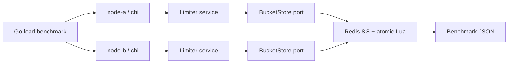

# Distributed Rate Limiter in Go: One Global Token Bucket across Nodes

**Two HTTP nodes enforce one global quota through atomic Redis state:** median `5,543.34 req/s` total, `1,197.66 req/s` accepted, `4,347.93 req/s` rejected, and `28.290 ms` p95, with zero errors and zero global-limit violations in three runs.

[](https://github.com/Brilhante29/go-rate-limiter/actions/workflows/ci.yml)
[](LICENSE)
 

## Why this exists

A rate limit that lives in each server's memory is not a limit: with N replicas, a client gets N times the quota, and the number changes every time the deployment scales. A shared counter fixes that only if the read-modify-write is atomic and clock skew between nodes cannot mint tokens. This limiter makes the global guarantee testable:

- Two independently addressed HTTP nodes consume the same Redis-backed bucket.
- One Lua script refills and consumes tokens atomically, using **Redis server time** instead of node clocks.
- The benchmark fails if either node is missing, unexpected responses occur, or accepted traffic exceeds the theoretical global maximum (burst plus refill).
- Store failures return `503` and fail closed.
- The limiter core imports neither chi nor go-redis; memory and Redis implement the same narrow output port, so unit tests stay deterministic.
- The default path uses no account, cloud service, or secret.

## Results

| Metric | Value | Meaning |
|---|---:|---|
| accepted_rps | 1,197.66 | Median requests admitted by the configured global quota |
| rejected_rps | 4,347.93 | Median excess requests rejected with HTTP 429 |
| total_rps | 5,543.34 | Median aggregate load handled by both nodes |
| p95_latency_ms | 28.290 | Median end-to-end p95 decision latency |
| nodes_observed | 2 | Proof that traffic reached both nodes |
| global_limit_violations | 0 | Accepted count stayed below burst + refill in every run |

Workload: one warm-up followed by three 5-second runs at concurrency 64, 1,000 tokens/s and burst 1,000. Measured on Docker Linux/amd64 with 6 CPUs, Go 1.26.5, Redis 8.8.0, and two independently addressed HTTP nodes on 2026-08-14. Throughput samples were 5,404.27, 6,473.98, and 5,543.34 req/s.

**How to read it:** the honest signal is `global_limit_violations = 0` with `nodes_observed = 2`. Accepted throughput (1,197.66 req/s) sits just under the theoretical ceiling of 1,200 req/s for a 5-second run (burst 1,000 plus 1,000 tokens/s), which is what one global bucket should produce across two nodes; rejected traffic is the excess load, not an error. Result: [`benchmarks/results/rate-limiter-baseline.json`](benchmarks/results/rate-limiter-baseline.json).

## Quickstart

```bash
docker build -t go-rate-limiter .
docker run --rm go-rate-limiter
```

The second command starts an ephemeral Redis process, exposes two internal HTTP nodes, drives the shared key under contention, prints JSON, and exits.

To run Redis and two application containers as a production-like local topology, and the optional k6 profile as an independent load check:

```bash
docker compose up --build -d redis node-a node-b
docker compose --profile load up --build --abort-on-container-exit --exit-code-from k6
```

## How it works


```mermaid
flowchart LR
  B["Go load benchmark"] --> A["node-a / chi"]
  B --> C["node-b / chi"]
  A --> U["Limiter service"]
  C --> U2["Limiter service"]
  U --> P["BucketStore port"]
  U2 --> P2["BucketStore port"]
  P --> R["Redis 8.8 + atomic Lua"]
  P2 --> R
  R --> J["Benchmark JSON"]
```

Dependency direction: `httpapi -> limiter <- redisstore`. The application policy does not import transport, Redis, cloud, or orchestration code.

### Algorithm

Each Redis key stores `tokens` and `updated_at_ms`. One atomic script:

1. reads Redis server time, avoiding node clock skew;
2. refills up to the configured burst;
3. consumes the requested cost when enough tokens remain;
4. returns allowed, remaining, and retry delay;
5. expires idle buckets to bound storage growth.

The in-memory adapter exists for deterministic unit tests and single-node development. It is intentionally not presented as the distributed proof.

### API

```http
POST /v1/limits/{key}/check
Content-Type: application/json

{"cost": 1}
```

- `200`: token consumed
- `429`: global quota exhausted, with `Retry-After`
- `400`: invalid key, cost, or body
- `503`: backing store unavailable

Contract: [`api/openapi.yaml`](api/openapi.yaml). Health: `GET /healthz`.

## Design decisions

| Decision | Why | Rejected |
|---|---|---|
| Redis with one atomic Lua script | The claim is one quota across nodes, and the script prevents read-modify-write races | In-memory-only limiter: it cannot preserve one quota across independent nodes |
| REST for the decision endpoint | A synchronous command with fixed input and output | GraphQL: a single command-style endpoint gains no useful query flexibility |
| No message broker | A rate-limit decision must complete on the request path | Kafka or RabbitMQ: asynchronous messaging cannot provide the synchronous atomic decision |
| Hexagonal boundaries only where substitution is exercised | Memory and Redis must be swappable without coupling policy or HTTP to either | Layered persistence (hides the atomic-store contract); microservices (failure modes without improving the shared-quota proof) |
| No cloud emulation | A managed Redis-compatible endpoint would remain configuration behind the same adapter | Kumo: no AWS API is emulated here |

## Testing

```bash
go test -race ./...
go vet ./...
pwsh -NoProfile -File tools/validate-project.ps1
```

The Docker build also compiles and tests the Go code, so the default path does not require a host Go installation.

## Limitations

- The benchmark is local and does not claim multi-region behavior.
- Redis availability is outside the limiter's responsibility; store failures return `503` and fail closed.
- The baseline uses one Redis instance. Cluster and failover semantics need separate failure benchmarks before being claimed.

## Reproducibility

1. Clone the repository and build the image: `docker build -t go-rate-limiter .`
2. Run it: `docker run --rm go-rate-limiter` prints the benchmark JSON.
3. Regenerate the committed result with `pwsh -NoProfile -File tools/benchmark.ps1` on Windows, Linux, or macOS.
4. Compare it with [`benchmarks/results/rate-limiter-baseline.json`](benchmarks/results/rate-limiter-baseline.json).

## Project structure

```text
cmd/go-rate-limiter/          CLI: serve, benchmark, demo
internal/limiter/             policy, service, BucketStore port
internal/adapters/redisstore/ atomic Redis adapter
internal/httpapi/             chi REST adapter
internal/loadbench/           multi-node benchmark and result writer
internal/demo/                one-command Docker orchestration
benchmarks/k6.js              independent k6 load profile
api/openapi.yaml              HTTP contract
sdd/                          decisions, benchmark plan, handoff, reuse review
```

## How this repository is built

The project follows the spec-driven workflow of [portfolio-reuse-kit](https://github.com/Brilhante29/portfolio-reuse-kit). Requirements and decisions live in [`sdd/`](sdd) and [`openspec/`](openspec), and [`project.yaml`](project.yaml) records the architecture, stack, and rejected alternatives. Development is AI-assisted and human-governed: [`AGENTS.md`](AGENTS.md) and [`CLAUDE.md`](CLAUDE.md) hold the coding-agent instructions, while tests, validators, and CI decide what gets published.

## Related work

- [api-gateway-lite](https://github.com/Brilhante29/api-gateway-lite): API-key authentication and quotas at the edge, with trace propagation.
- [load-test-suite](https://github.com/Brilhante29/load-test-suite): reusable k6 latency curves.
- [cache-strategies-bench](https://github.com/Brilhante29/cache-strategies-bench): Redis on the read path instead of the decision path.

See [`REFERENCES.md`](REFERENCES.md) for official documentation, licenses, and organizational references.

## Author

**Guilherme Brilhante**, software engineer working on scalable backends and production AI.
[LinkedIn](https://www.linkedin.com/in/guilhermefreirebrilhanteseveriano/) · [GitHub](https://github.com/Brilhante29) · [Publications](https://dblp.org/pid/353/6812.html)

## License

[MIT](LICENSE).
